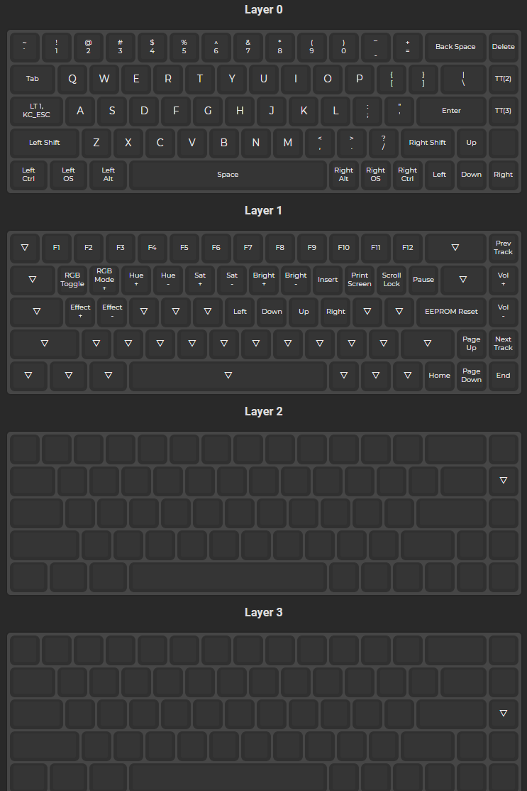

# JoshBlu custom qmk_keymaps

This repo is set up to use build using Github Workflows as detailed [here](https://docs.qmk.fm/#/newbs_building_firmware_workflow). However the default workflow has been modified to better support multiple keyboards. 

The default work flow assumes the standard userspace setup where rules.mk, config.h, etc. will be shared between all of the user's keyboards. This workflow allows the user to have multiple independent directories, each containing their own rules.mk, config.h, and keymap.json.

## Currently supported layours

### dz65rgb layout:

